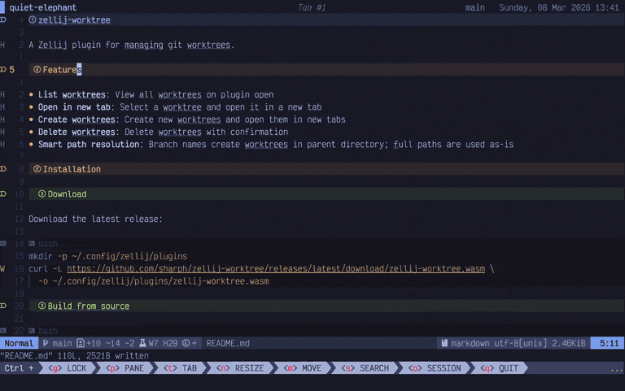

# zellij-worktree

A Zellij plugin for managing git worktrees.



## Features

- **List worktrees**: View all worktrees on plugin open
- **Open in new tab**: Select a worktree and open it in a new tab
- **Create worktrees**: Create new worktrees and open them in new tabs
- **Delete worktrees**: Delete worktrees with confirmation
- **Smart path resolution**: Branch names create worktrees in parent directory; full paths are used as-is

## Configuration and Installation

Add to your `~/.config/zellij/config.kdl`:

```kdl
plugins {
    worktree location="https://github.com/sharph/zellij-worktree/releases/latest/download/zellij-worktree.wasm"
}
```

Add a keybinding:

```kdl
shared_except "locked" "tab" {
    bind "Ctrl w" {
        LaunchOrFocusPlugin "https://github.com/sharph/zellij-worktree/releases/latest/download/zellij-worktree.wasm" {
            floating true
        }
    }
}
```

### Optional: Custom base path

```kdl
plugins {
    worktree location="https://github.com/sharph/zellij-worktree/releases/latest/download/zellij-worktree.wasm" {
        base_path "~/projects"
    }
}
```

### Build from source

```bash
git clone https://github.com/sharph/zellij-worktree
cd zellij-worktree
cargo build --release
cp target/wasm32-wasip1/release/zellij_worktree.wasm ~/.config/zellij/plugins/
```

## Usage

### Open Worktree

1. Press your keybinding (e.g., `Ctrl+w`)
2. Use `j`/`k` or arrow keys to navigate the list
3. Press `Enter` to open the selected worktree in a new tab

### Create Worktree

1. Open the plugin
2. Press `n` to create a new worktree
3. Type a branch name or full path
   - Branch name: creates worktree at `base_path/<branch-name>` (if configured) or `../<branch-name>`
   - Relative path (starting with `./` or `../`): relative to repo root
   - Full path (starting with `/` or `~`): uses exact path
4. Press `Enter` to create the worktree and open a new tab

### Delete Worktree

1. Open the plugin
2. Use `j`/`k` or arrow keys to navigate to the worktree
3. Press `d` to request deletion
4. Press `Enter` to confirm deletion
5. Press `Esc` to cancel

### Keybindings

| Key | Action |
|-----|--------|
| `Esc` | Close plugin / Cancel action |
| `Ctrl+c` | Close plugin |
| `Enter` | Open selected worktree / Confirm action |
| `j`/`k` or ↑/↓ | Navigate list |
| `n` | Create new worktree |
| `d` | Delete selected worktree |

## Requirements

- Zellij 0.42.0 or later
- Git

## License

MIT
